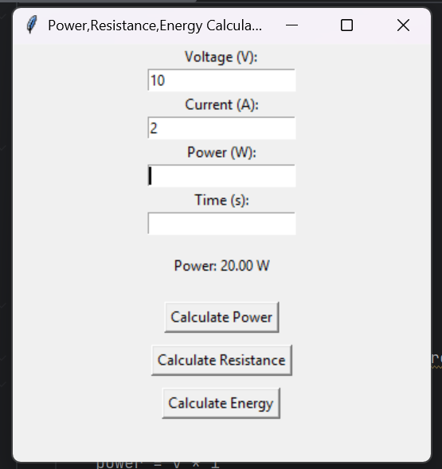
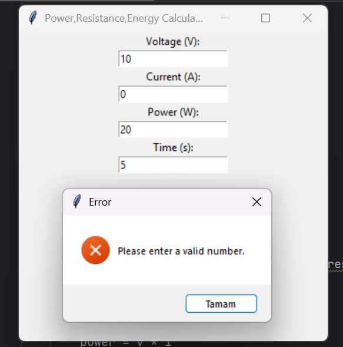

# Electrical-Power-Energy-and-Resistance-Calculator-With-GUI
This project is a simple graphical calculator developed with Python to perform basic electrical engineering calculations. It was created as an educational project to combine fundamental electrical engineering concepts with basic software development and GUI design.

## Purpose of the Project
The main goal of this project is to:
- Apply basic electrical engineering formulas programmatically
- Practice Python programming and GUI development
- Gain experience with GitHub project documentation and version control

This project is intended for learning purposes and beginner-level practice

## Features
- Power calculation (P = V * I)
- Resistance calculation (R = V / I)
- Energy calculation (E = P * t)
- User friendly graphical interface
- Basic input validation and error handling

## Technologies Used
- Python
- Tkinter (Python built-in GUI library)

No external libraries are required

## Screenshots
### Power Calculation Example

### Resistance Calculation Example

### Energy Calculation Example

### Error Example

## How to Run
1. Make sure Python 3 is installed.
2. Download or clone this repository.
3. Run the following command: main.py
